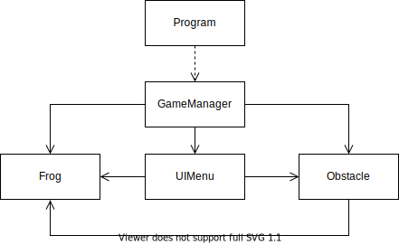
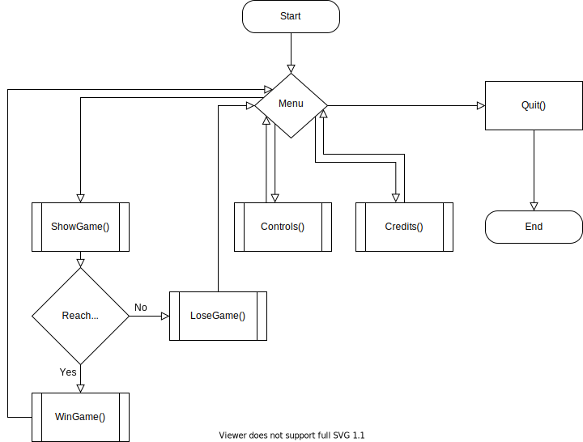

# Frogger

## Projeto 2 LP2

## Autoras

* [Diana Nóia](https://github.com/diananoia), a21703004
* [Inês Gonçalves](https://github.com/ineesgoncalvees), a21702076

## Repartição de Tarefas

* **Diana Nóia**
  * Movimento do jogador;
  * Colisões com os obstáculos;
  * Vidas/Pontos do jogador;
  * GameManager;
  * Menu;
  * Relatório;
  * UML;

* **Inês Gonçalves**
  * Movimento do jogador;
  * Movimento e Render obstáculos;
  * Colisões com os obstáculos;
  * Vidas/Pontos do jogador;
  * SafeZone e Endzone;
  * Fix Layout e outros erros;
  * HighScores;
  * Relatório;
  * UML;

### Repositório

O projeto pode ser encontrado neste [repositório](https://github.com/DianaNoia/Frogger).

## Arquitetura da solução

O jogo começa por mostrar o menu inicial e pedir *input* ao utilizador para
escolher uma das opções apresentadas. Ao iniciar o jogo em si, o utilizador tem
de mover o sapo através dos obstáculos até à linha final 5 vezes, sem perder as
3 vidas. O jogador recebe 100 pontos por ultrapassar a *safe zone* (linha branca
no meio do ecrã) e 500 pontos por chegar à zona final (linha azul).  
Quando o jogo termina, independentemente se o jogador conseguiu chegar ao fim
sem perder as 3 vidas ou não, volta ao menu inicial, no qual é novamente pedido
input ao utilizador.

Tentamos seguir os principios *SOLID* para a organização do projeto, em
particular o *Single Responsability Principle*, com uma classe para cada coisa
(como *p.e.*, uma classe para desenhar o menu, etc.).  
O GameLoop inicializa e atualiza o jogo através dos métodos `Start()` e
`Update()`, respetivamente, e utiliza a Thread principal.

Tentámos mostrar uma lista de Highscores, utilizando o StreamReader/StreamWriter
para guardar as pontuações num ficheiro e depois mostrá-las, mas não conseguimos
finalizar essa parte.

Este projeto foi útil para consolidar o nosso conhecimento sobre Threads e
como/quando utilizá-las.

### Diagrama UML

O UML deste projeto é o seguinte:

;

### Fluxograma

O fluxograma deste projeto é o seguinte:

;

## Referências

Slides e videos das aulas de LP2;

A [API do C#](https://docs.microsoft.com/en-us/dotnet/csharp/);
